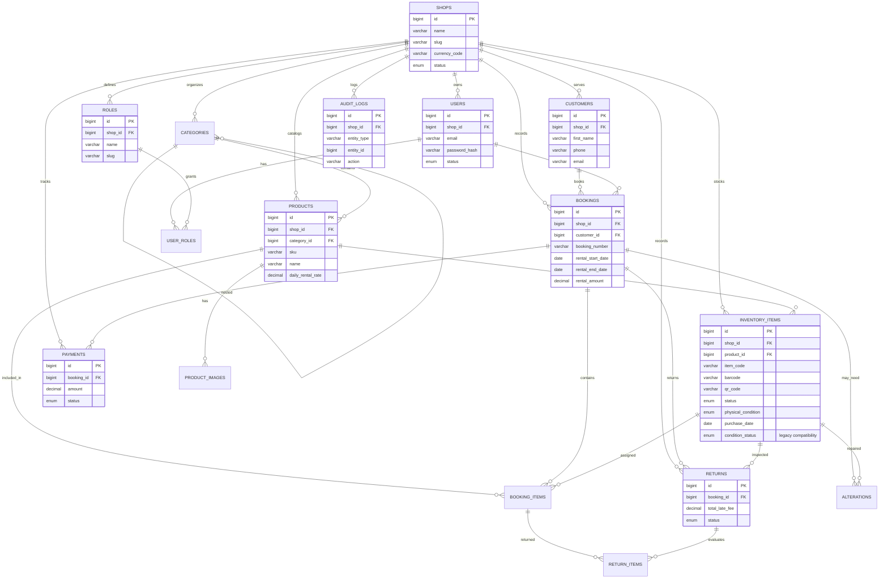

# Entity Relationship Diagram

## Relationship notes
- A single `shop` owns all operational records for its tenant domain.
- `customers`, `products`, `bookings`, and related tables remain isolated by `shop_id`.
- `inventory_items` connect to a specific product and represent physical units. Current status and physical condition are independent; availability by dates belongs to booking workflows.
- `booking_items` provide the line-item record needed for rental calculations and return processing.
- `audit_logs` track all material changes to business entities for traceability.
